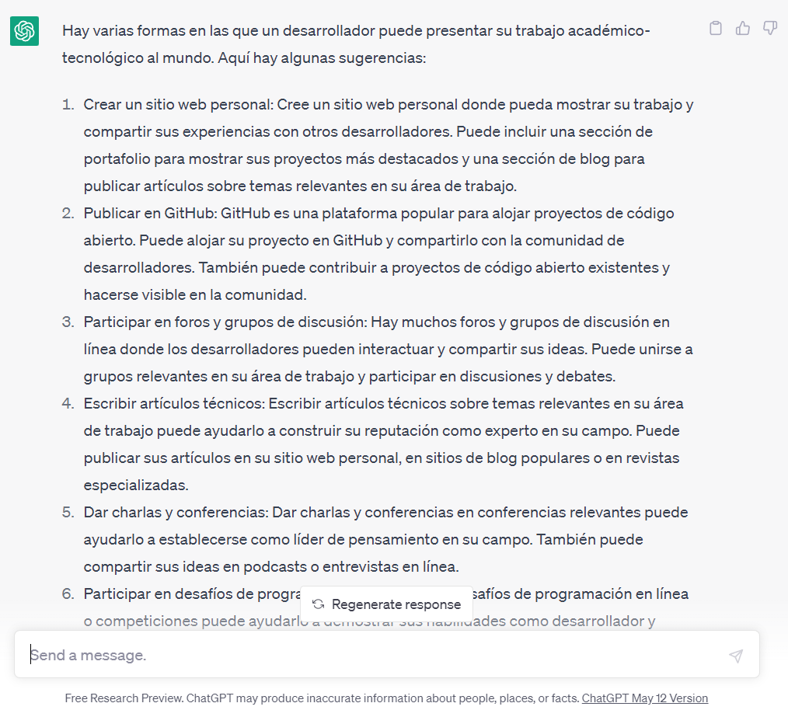

..
  Copyright (c) 2025 Allan Avendaño Sudario
  Licensed under Creative Commons Attribution-ShareAlike 4.0 International License
  SPDX-License-Identifier: CC-BY-SA-4.0

============================================
Proyecto 01: Portafolio de identidad digital
============================================

.. topic:: Objetivo general
    :class: objetivo

    Implementar un medio que refleje la identidad digital del desarrollador, facilitando la presentación de sus habilidades y proyectos de manera clara y accesible.

.. admonition:: Prompt

    Como desarrollador, ¿De qué manera puedo compartir mis proyectos técnicos-tecnológicos con el mundo de forma accesible y profesional?

.. toctree::
  :maxdepth: 1
  
  ../plan/proyecto01.rst