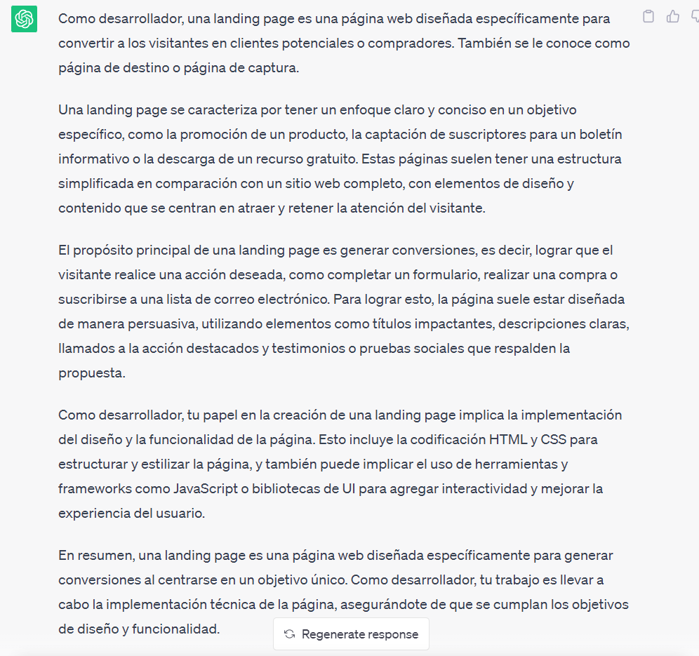

..
  Copyright (c) 2025 Allan Avendaño Sudario
  Licensed under Creative Commons Attribution-ShareAlike 4.0 International License
  SPDX-License-Identifier: CC-BY-SA-4.0

==============================================
Proyecto 02: Explorando la cultura con la web 
==============================================

.. topic:: Objetivo general
    :class: objetivo

    Desarrollar un sitio web que comunique la interacción entre la comunidad y una actividad social, cultural, artística o deportiva mediante el uso de tecnologías nativas de la web.

.. admonition:: Prompt

    Como desarrollador, explica ¿Qué es una landing page?

.. toctree::
  :maxdepth: 1
  :caption: Contenido
  
  ../plan/proyecto02.rst