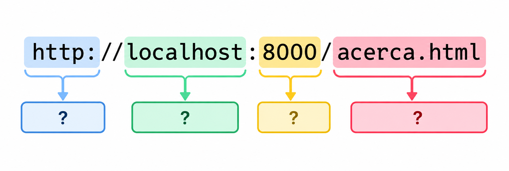
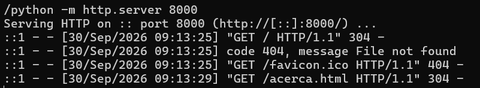
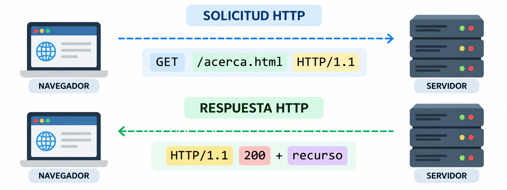

..
   Copyright (c) 2025 Allan Avendaño Sudario
   Licensed under Creative Commons Attribution-ShareAlike 4.0 International License
   SPDX-License-Identifier: CC-BY-SA-4.0

========================================================
Guía 01: Cliente y servidor en la web 
========================================================

.. topic:: Objetivo específico
    :class: objetivo

    Comprender el modelo cliente-servidor en la Web, identificando el rol del navegador y del servidor durante el proceso de solicitud y respuesta de recursos, mediante la ejecución, observación y análisis de aplicaciones web sencillas.

Actividades en clases
=====================

¿Quién es el cliente y quién el servidor cuando usas WhatsApp Web, Netflix y una impresora de red?
--------------------------------------------------------------------------------------------------

1. Copia el siguiente código en tu editor de texto y guárdalo como `index.html`:

.. code-block:: html
    
    <!DOCTYPE html>
    <html lang="es">
    <head>
        <meta charset="UTF-8">
        <meta name="viewport" content="width=device-width, initial-scale=1.0">
        <title>Mi primer sitio web</title>
    </head>
    <body>
        <h1>¡Hola, mundo!</h1>
        
Este es mi primer sitio web.

    </body>
    </html>

2. Desde el directorio donde se encuentra `index.html`, ejecuta el siguiente comando en la terminal para iniciar un servidor web local:

.. code-block:: bash
    
    python -m http.server 8000

Luego, abre tu navegador web y visita `http://localhost:8000` para ver tu sitio web en acción.

Preguntas guía y de reflexión
^^^^^^^^^^^^^^^^^^^^^^^^^^^^^

1. ¿Quién cumple el rol de cliente y quién el de servidor?
2. En la actividad realizada, ¿qué programa está actuando como cliente?
3. ¿Qué elemento está actuando como servidor web?
4. ¿Qué representa localhost en la dirección http://localhost:8000?
5. ¿Qué representa el número 8000?
6. ¿Qué ocurre desde que escribe http://localhost:8000 en el navegador hasta que aparece “¡Hola, mundo!”?
7. ¿Cuál es la diferencia entre abrir directamente index.html y acceder a él mediante http://localhost:8000?
8. En esta actividad, ¿el cliente y el servidor están en la misma computadora? ¿Podrían encontrarse en computadoras diferentes?

¿Qué ocurre cuando escribo una URL?
-----------------------------------

1. Dentro de la misma carpeta donde se encuentra `index.html`, cree un segundo archivo llamado `acerca.html` con el siguiente contenido:

.. code-block:: html

    <!DOCTYPE html>
    <html lang="es">
    <head>
        <meta charset="UTF-8">
        <meta name="viewport" content="width=device-width, initial-scale=1.0">
        <title>Acerca de</title>
    </head>
    <body>
        <h1>Acerca de</h1>
        
Esta es la página acerca de mi sitio web.

    </body>
    </html>

2. Sin detener el servidor, pruebe las siguientes direcciones en el navegador:

.. code-block:: text

    http://localhost:8000/index.html
    http://localhost:8000/acerca.html
    http://localhost:8000/noexiste.html

Preguntas guía y de reflexión
^^^^^^^^^^^^^^^^^^^^^^^^^^^^^

1. Para cada URL, registre qué observa en el navegador y qué aparece en la terminal del servidor.

.. list-table::
   :header-rows: 1
   :widths: 35 12 15 10 25 15

   * - URL
     - Protocolo
     - Servidor
     - Puerto
     - Recurso solicitado
     - Resultado
   * - ``http://localhost:8000``
     -
     -
     -
     -
     -
   * - ``http://localhost:8000/index.html``
     -
     -
     -
     -
     -
   * - ``http://localhost:8000/acerca.html``
     -
     -
     -
     -
     -
   * - ``http://localhost:8000/contacto.html``
     -
     -
     -
     -
     -

2. A partir de sus observaciones, proponga una explicación para cada componente:

3. Realice una búsqueda breve sobre el significado de **URL**. No copie textualmente la definición encontrada.
Con la información investigada y la experiencia anterior, construya una definición propia que complete:

.. centered:: Una URL es ___________________ y permite ______________________________.

4. Cree una tercera página llamada `contacto.html` y modifique `index.html` agregando:

.. code-block:: html

    
Visita nuestra <a href="contacto.html">página de contacto</a>.

5. ¿Qué información necesita el navegador para localizar un recurso?
6. ¿Qué partes permanecen iguales en las URL utilizadas y cuáles cambian?

¿Cómo funciona la comunicación entre el cliente y el servidor?
----------------------------------------------------------------

Considerando el ejercicio anterior, revisa la terminal donde se ejecuta el servidor y observa los mensajes que aparecen cuando se solicita un recurso. 

Preguntas guía y de reflexión
^^^^^^^^^^^^^^^^^^^^^^^^^^^^^

1. Formule una hipótesis sobre el significado de cada componente.

.. list-table::
   :header-rows: 1
   :widths: 20 35 45

   * - Componente
     - ¿Qué cree que significa?
     - Definición después de investigar
   * - ``GET``
     -
     -
   * - ``/acerca.html``
     -
     -
   * - ``HTTP/1.1``
     -
     -
   * - ``200``
     -
     -

2. A partir de lo observado, complete el siguiente esquema:

Identifique:
    - ¿Quién realiza la solicitud?
    - ¿Quién recibe la solicitud?
    - ¿Qué recurso se solicita?
    - ¿Qué método se utiliza?
    - ¿Cómo informa el servidor que la solicitud fue exitosa?

3. Investigue brevemente el significado de los códigos 200, 304 y 404 y complete:

.. list-table::
   :header-rows: 1
   :widths: 15 45 40

   * - Código
     - ¿Qué ocurrió?
     - ¿El recurso existe?
   * - ``200``
     -
     -
   * - ``304``
     -
     -
   * - ``404``
     -
     -

Referencias
============

* 3.14.7 Documentation. (n.d.). Python Documentation. Retrieved September 30, 2026 from https://docs.python.org/es/3/
* HTTP | MDN. (n.d.). Retrieved September 30, 2026 from https://developer.mozilla.org/es/docs/Web/HTTP